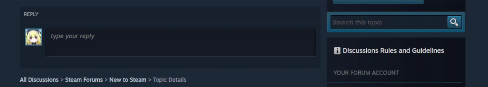

<p align="center">
  
</p>

<!-- <h1 align="center">Clak</h1> -->

<!-- <p align="center">
  <em>Bộ gõ tiếng Việt ổn định cao dành cho Linux</em>
</p> -->

## Cài đặt

### Ubuntu / Debian:

Cài nhanh qua script tự động (tự nhận diện và cấu hình Fcitx5):

```bash
curl -fsSL https://raw.githubusercontent.com/versenilvis/clak/main/scripts/install.sh | bash
```

Hoặc tải gói `.deb` từ [Releases](https://github.com/versenilvis/clak/releases) rồi cài đặt:

```bash
sudo apt install ./clak_*_amd64.deb
```

### Arch Linux (AUR):

```bash
# bản prebuilt binary dựng sẵn (khuyên dùng)
yay -S clak-bin
# hoặc paru -S clak-bin

# hoặc tự build từ source
yay -S clak
```

### Nix Flake:

```bash
nix profile install github:versenilvis/clak
```

> [!NOTE]
> Clak có sẵn bàn phím tiếng Anh, bạn không cần thêm bất cứ bàn phím nào khác ngoài Clak cả\
> Sử dụng tổ hợp phím `Ctrl + Shift` để chuyển đổi ngôn ngữ\
> Clak mang lại trải nghiệm gõ giống hệt như trên Windows

## Các điểm chính

- Clak giúp bạn gõ trên Twitter/X mượt mà btw


- Clak giúp bạn gõ trên Google Docs mượt mà btw


- Clak giúp bạn gõ trên Facebook, các web của Meta mượt mà btw


- Clak giúp bạn gõ trên thanh địa chỉ URL mượt mà btw


- Clak giúp bạn gõ trên các app Electron mượt mà btw


- Clak giúp bạn gõ trên Telegram Desktop/Web mượt mà btw


- Clak có thể detect được các terminal code editor như Neovim và biết chính xác đang ở mode nào để giúp trải nghiệm muợt mà hơn btw


- Clak giúp bạn gõ trên WPS Office/LibreOffice mượt mà btw


- Clak giúp bạn gõ trên các IDE JetBrains mượt mà btw


- Clak giúp bạn gõ trên Steam Client mượt mà btw



> [!IMPORTANT]
> Những thứ trên được test trên môi trường Arch + Wayland, chưa chắc trên môi trường máy bạn sẽ không bị lỗi

## Menu cài đặt

<div align="center" >
  
  <i><b>Clak có cả menu UI độc lập</b></i>
</div>


> [!NOTE]
> **Một số lí do như sau khiến binary size của Menu UI Clak khá lớn (khoảng gần 50MB):**\
> Clak load và sử dụng font `SF Pro` vì sở thích cá nhân của maintainer (vì thấy đẹp)\
> Clak dùng `renderer-skia-opengl` thay vì `renderer-femtovg` liên quan tới font-rendering, subpixel anti-aliasing, text-sharping, font fallback, ...\
> Clak có 1 banner nhỏ (vẫn là vì đẹp)\
> Ngoài ra có 1 số SVG nữa\
> Nhìn chung là tính thẩm mỹ cao hơn rất nhiều, cũng như nhờ vậy mà tích hợp nhiều tính năng như **Chẩn đoán hệ thống**, **Cập nhật hệ thống**, ...

> *Nếu bạn thấy nặng thì hãy mở 1 Issue, mình sẽ tạo 1 UI độc lập tích hợp trong Fcitx 5 cho nhẹ kèm option chỉ cài đặt UI này thay vì UI chính (nhưng chắc chắn sẽ không đầy đủ chức năng như menu chính)*

## Gỡ cài đặt

Clak Settings > Giới thiệu > Gỡ cài đặt


## Feedback

> [!TIP]
> Bạn có thể dùng chức năng **Chẩn đoán** để quét nhanh Clak có đang bị lỗi gì với hệ thống không\
> Điều đó giúp bạn debug nhanh hơn và cũng như có thể sao chép để gửi lên cho maintainer\
> Xem thêm tài liệu kỹ thuật chi tiết tại [docs/README.md](docs/README.md) và hướng dẫn chẩn đoán lỗi tại [docs/debugging.md](docs/debugging.md).

- [Email](mailto:versedev.store@proton.me)
- [Twitter](https://twitter.com/versenilvis)
- [GitHub issues](https://github.com/versenilvis/clak/issues/new)

## Giấy phép

Bộ gõ này được cấp phép bởi giấy phép [0BSD License](LICENSE). Điều đó có nghĩa rằng bạn có thể sửa, xóa, thêm hay làm bất cứ thứ gì bạn muốn với nó.
